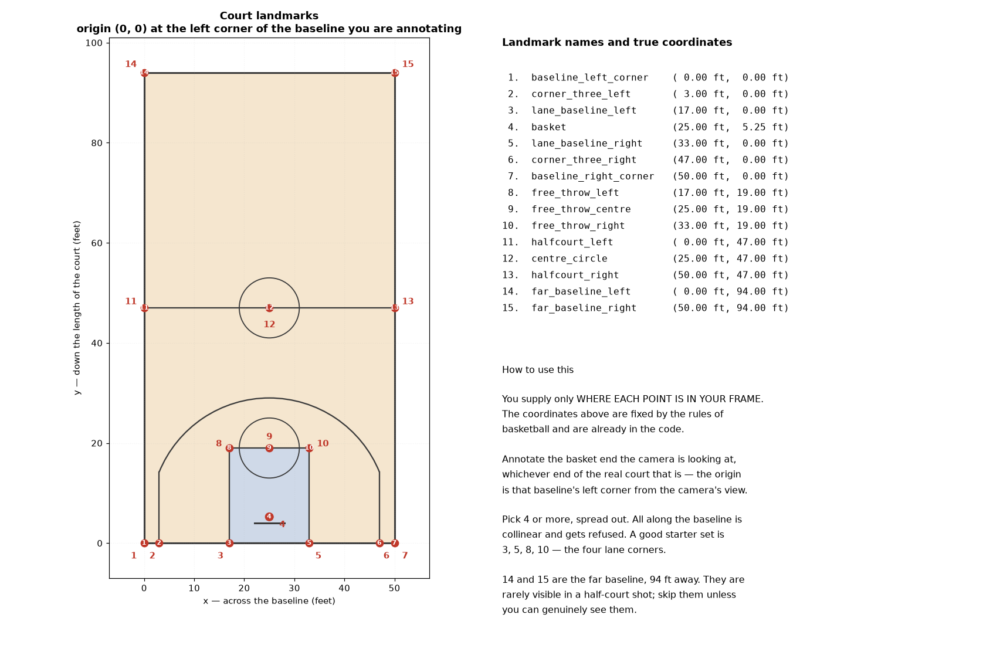
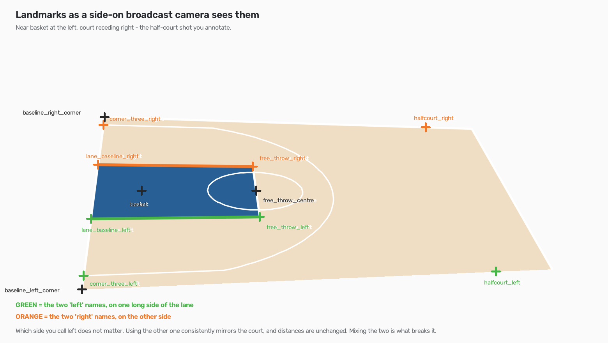

# Testing & Verification

How to check the pipeline yourself, without reading the code.

There are two kinds of check here and they answer different questions. The
automated one asks *"is anything broken?"*. The visual one asks *"is the
output any good?"*. Only the second can close a milestone — every "done when"
in `06-roadmap.md` is phrased as something you look at — but the first catches
the silent table corruption that a glance never would.

## 1. Automated — `tools/verify.py`

```bash
python tools/verify.py
```

Regenerates the synthetic clip and runs every implemented stage over it, then
checks the output against answers that are known because the clip was built
with them: three cuts at fixed frames, ten players per frame, five per kit
colour. Exit code is 0 only if everything passes, so it works as a gate.

Expect **32/32 passed**. Run it after any change to the pipeline; if a check
that used to pass now fails, that change broke something.

What it proves: schemas, shot segmentation, per-shot tracker resets, team
clustering, possession plumbing. What it does **not** prove: anything about
real footage. Detector recall, id stability through contact and clustering
accuracy on actual kits cannot be checked without ground truth, which the
synthetic clip has and real video does not.

### On real footage

```bash
python tools/verify.py --game-id S_N3_HD --structural
```

Skips ground truth and runs only the invariants that must hold for any
footage: documented columns present, no tracker_id appearing twice in one
frame, foot points at the bottom-centre of their box, possession referring to
tracks that exist, confidences within 0-1.

This cannot tell you the output is *correct*. It tells you the tables are not
malformed — which is worth knowing, because most bugs found so far were
exactly that: tracker ids colliding with the ball's `-1` sentinel, a track
reported as spanning 107% of its shot, and Stage 2 silently writing an empty
table when its filters rejected everything.

## 2. Visual — the viewer

```bash
streamlit run app.py
```

On Windows use the launcher — `.\run_viewer.bat` in PowerShell, which
requires the `.\`, or `run_viewer.bat` in Command Prompt. It needs no
activation and can be double-clicked. Otherwise
`.venv\Scripts\python.exe -m streamlit run app.py` works in either shell.

Pick the game in the sidebar. The sidebar also shows which stages have run.

### Tab 1 — Detection

**Question: are the boxes on players and the ball?**

Step frame by frame rather than scrubbing; a ball detection dropping out
during a pass is invisible at coarse resolution. Watch the per-frame count
chart for dips.

- Good: roughly 10-15 boxes per frame, confidence mostly high.
- Bad: 50+ boxes per frame means the detector is finding the crowd — use a
  basketball-trained model (see the README).
- Bad: fewer than 10 means it is missing players; check the source resolution
  before touching any parameter, since that dominated everything else here.

### Tab 2 — Tracking

**Question: do ids stay stable, and where do they break?**

The **tracking quality table** is the fastest read. `median/frame` should be
about 10 and `tracks >90% shot` should ideally be 10. The `verdict` column
names the dominant problem, and the distinction matters because the fixes are
opposite:

| verdict | meaning | what to change |
|---|---|---|
| `low recall` | fewer boxes than players | better detector, higher resolution |
| `clutter` | more boxes than players on court | crowd is being tracked — better detector, or a court polygon |
| `fragmenting` | right count, too many ids | tracker: try `--tracker`, raise `--lost-track-buffer` |
| `PASS` | 10 stable tracks | nothing |

Then **render the clip as a GIF and watch it**. Id stability reads far better
in motion than in stills — two players swapping colours mid-clip is an id
switch, and a table cannot show you that as clearly as three seconds of video.

The **court polygon tuner** lets you fit the playing surface interactively:
drag the numbers until green boxes are players and red boxes are crowd, watch
"median kept/frame" approach 10, then save it as a profile. Skip this entirely
if you are using a basketball-trained detector — it will clip real players.

### Tab 3 — Team Classification

**Question: do the two crop groups obviously correspond to the two kits?**

This is a five-second check, not a chart. Glance at the grid; if one group is
clearly the home whites and the other clearly the away darks, the stage works.

- A crop that plainly belongs to the other group is a clustering error. The
  usual cause is a crop contaminated by background or an overlapping player,
  not the colour model.
- Check the `other` bucket contains referees, coaches and crowd, and not real
  players. If it is swallowing players, raise `--ambiguity-ratio`.
- Lopsided groups (say 18 vs 4) mean one kit is being split.

### Tab 4 — Ball Possession

**Question: is the highlighted player the one actually holding the ball?**

Scrub through a span and watch the `ball_distance_px` number. It should sit
near 0 while someone holds the ball and spike during a pass.

- Frames with **no handler are correct**, not failures — a ball in flight
  belongs to nobody, and roughly half of a possession's frames legitimately
  have no holder.
- The **possession timeline** should change at passes and rebounds. Many very
  short spans mean `--debounce-frames` is too low; one span swallowing an
  obvious pass means it is too high.
- A handler far from the ball means the ball selection has locked onto a false
  positive; lower `--max-jump-frac`.

### Tab 5 — Court Calibration

**Question: does the homography put players where they actually are?**

Pick a landmark from the dropdown and click it in the frame; the coordinates
are written into the text box, where they can also be nudged by hand. A
labelled coordinate grid is available if you would rather read positions off
and type them.



Every landmark name, drawn where it sits on a real court, with the
coordinates the code already holds. Regenerate with
`python tools/court_reference.py` if the landmark table changes.

Reading that top-down and then finding the same corner in a side-on
broadcast frame is the step that actually trips people up — the lane stops
looking like a rectangle, and "left" stops meaning "on the left of the
screen". So the same landmarks are also drawn as a camera sees them:



The perspective there is computed by projecting the real court model, not
drawn by hand, so each label sits where that landmark genuinely would.
Regenerate with `python tools/court_camera_reference.py`.

**Left versus right.** The two `left` names go on one long side of the lane
and the two `right` names on the other. Which physical side you call left
does not matter: naming the other one consistently produces a mirrored
court, and a mirror preserves every distance, so a distance metric is
unaffected. Mixing the two — `lane_baseline_left` from the far side,
`free_throw_left` from the near side — makes the quadrilateral cross itself,
and the resulting homography is nonsense that can still report a small
residual. The tab checks for that crossing and refuses it.

- **Reprojection error** under ~15px is good. Above 20 the tab warns you, and
  the per-landmark table names the worst offender.
- The **radar** is the check that matters. Dots must land inside the court
  rectangle, in the same arrangement as the players in the frame. A tidy
  reprojection error with dots strewn outside means the landmarks are
  internally consistent but wrong — usually two of them swapped.
- Spread landmarks out. Four points along the baseline are collinear and are
  refused outright rather than fitted to nonsense.
- **Annotate near the middle of the possession you care about.** The
  broadcast camera pans within a shot, and one homography cannot follow it,
  so accuracy is best near the annotated frame and worst at the extremes.
  Check the radar at the start, middle and end of a shot rather than trusting
  one frame.

## 3. Per-run scorecards

Every `02_track.py` run prints its own quality line, so the CLI answers the
same question as Tab 2 without opening anything:

```
shot 11: 31 track(s), median 10/frame (79% of frames have 10+), longest 461f (99%), 6 track(s) span the shot - fragmenting - right count per frame, ids not persisting
```

`03_identify.py` prints the team split and silhouette; `04_ball_possession.py`
prints the possession radius, the share of frames with a handler, and the
number of spans. These are the numbers to quote when comparing two
configurations — that is how the detector and tracker comparisons in the
README were run.

## What is not tested

No milestone is closed, so none of this proves the pipeline works end to end.
In particular:

- **Milestone 1 is open.** Six of ten players hold a single id for a full
  possession; the rest fragment. No automated check will tell you that is
  acceptable — you have to watch the clip and decide.
- **No camera angle has been annotated**, so despite Stage 5 existing there
  is no homography for real footage and distances are still in pixels rather
  than feet. **Stage 6 does not exist**, so no track resolves to a player name.
- **Everything so far is one possession.** 465 frames of 7,786. Behaviour at
  scale, across camera angles and replays, is unmeasured.
